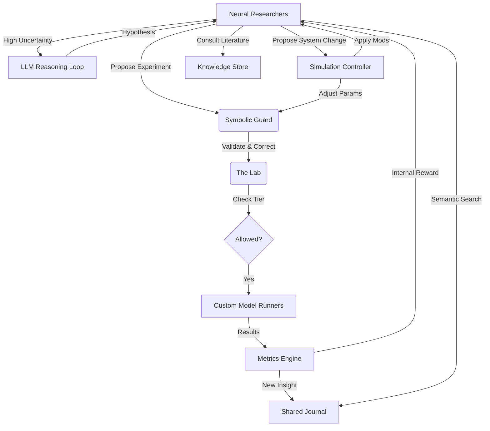

# 🧪 Meta-RL Scientist

**An Autonomous Multi-Agent RL Research Laboratory**

Meta-RL Scientist is a sophisticated, closed-loop simulation where AI agents act as **Reinforcement Learning Researchers**. These agents autonomously read literature, maintain causal models, and learn to execute parallel experiments through a recurrent neural network "Brain."

---

## 🚀 Key Features

### 🧠 Hybrid Reasoning Architecture
- **Dual-Process Theory**: Agents combine **"Fast" Neural decision-making** (RNN-driven) for tactical optimization with **"Slow" LLM Reasoning** (Hypothesis-driven) for strategic pivots.
- **LLM-Driven Hypotheses**: High-uncertainty states trigger a "Reasoning Loop" where agents gather context from literature and peer success and use an LLM to generate testable natural-language hypotheses.
- **Natural Language Translation**: LLMs translate hypotheses into concrete, valid `ExperimentConfig` structures.

### 📚 Centralized Knowledge & Shared Journal
- **Dynamic Insight Logging**: After successful experiments, agents publish concise, natural-language "Insights" to a shared journal.
- **Peer-to-Peer Learning**: All agents can semantically search the journal, allowing discoveries (e.g., "higher learning rate works better on LunarLander") to propagate instantly across the swarm.
- **Literature Integration**: Real-time integration of research papers via a vector-backed `KnowledgeStore`.

### 🏗️ Neural Architecture Search (NAS)
- **Generative Design**: Agents now propose entire model architectures by generating custom PyTorch and Stable Baselines3 policy code.
- **Dynamic Runners**: The Vision and RL runners support on-the-fly execution of dynamic, LLM-generated code strings, enabling the swarm to design its own neural structures.

### 🛠️ Self-Modification Support
- **System Tuning**: Elite agents can propose and apply changes to simulation-level parameters (e.g., `update_interval`), allowing the lab to adapt its own meta-parameters based on current performance.
- **Automated Refinement**: The lab environment evolves its dispatching and resource allocation strategies based on agent feedback.

### 🐝 Swarm Dynamics
- **Leaderboard**: Real-time ranking of agents by meta-reward and efficiency.
- **Competitive Harvesting**: Successful agents share weights and insights with those falling behind, maintaining high population diversity.

### 🎓 Self-Paced Curriculum
- **Tiered Progression**: Agents start on simple tasks and unlock harder ones only after proving proficiency.
    - **Tier 0**: `CartPole-v1`, `Pendulum-v1`
    - **Tier 1**: `LunarLander-v3`, `Acrobot-v1`
    - **Tier 2**: `MountainCarContinuous-v0`
- **Auto-Promotion**: The entire lab advances when *any* agent solves the current tier, fostering swarm collaboration.

### 💾 Long-Term Episodic Memory
- **Experiment Persistence**: Agents store and retrieve successful experiment configurations to initialize new search processes.
- **Context Injection**: The best past hyperparameters are injected directly into the Brain as a conditioning vector.

### 🏛️ Hierarchical Strategic Planning
- **Manager-Worker Core**: The Brain first determines a **Strategic Intent** (EXPLORE, EXPLOIT, or REFINE) before proposing tactical configurations.
- **Goal-Conditioned Policies**: Lower-level worker heads are soft-conditioned on the selected strategic goal.

### 🎭 Multi-Objective "Specialists"
- **Scientist Profiles**: Agents are spawned with distinct research mandates:
    - **Perf-Max**: Focused on absolute reward.
    - **Fast-Efficient**: Prioritizes speed and sample efficiency.
    - **Stable-Reliable**: Prioritizes consistency and low variance.
- **Multi-Objective Rewards**: Laboratory evaluation incorporates Performance, Stability, Efficiency, and Novelty into a single weighted meta-reward.

### ⚡ Async-First Core
- **Non-Blocking Simulation**: The main loop is fully asynchronous, ensuring that slow LLM operations (embeddings, chat, vision) never stall agent decision-making.
- **Async Knowledge Store**: Distributed knowledge shards and the shared journal leverage `httpx` for high-concurrency external API calls.
- **Dynamic Ingestion**: The `KnowledgeWatcher` detects new files and processes them in the background, allowing the project to learn in real-time.

### 🛡️ D3 Engine Integration (Neuro-Symbolic)
- **Trajectory Vector Compression**: Summarizes and embeds past experiments into a fixed vector space, providing the swarm with "Negative Knowledge" to avoid past failures.
- **Symbolic Verification Layer**: A deterministic guard that validates hyperparameters and estimates resource budgets before execution, ensuring safety and efficiency.
- **Latent vs. Active Memory**: Long-term history is relegated to the vector store (Latent), while the agent's immediate context remains focused on the current frontier (Active).

---

## 🛠️ Architecture



---

## ⚡ Quick Start

### Installation
```bash
pip install -e .
pip install watchdog
```

### Running the Scientist
```bash
# Start a hybrid simulation with 2 agents
python marl_scientist/main.py --agent-type neural --num-agents 2 --steps 10
```

### Adding New Knowledge
Drop `.txt` or `.md` files into `knowledge/`. The **Async Watcher** will instantly ingest and embed them without stopping the simulation.

---

## 🗺️ Roadmap
- [x] Multi-Process Parallelization
- [x] Neural "Brain" (Meta-RL)
- [x] Async Knowledge Ingestion
- [x] Swarm Dynamics (Leaderboard, Bonus Slots)
- [x] Curriculum Learning (Tiers, Auto-Promotion)
- [x] Long-Term Episodic Memory
- [x] Hierarchical Decision-Making
- [x] Trajectory Vector Compression (D3 Engine Phase 1)
- [x] Symbolic Verification Layer (D3 Engine Phase 2)
- [x] Async-First Engine (Async LLM, Async Knowledge Store)
- [x] Active/Latent Agent Brain Split (D3 Engine Phase 3)
- [x] Hybrid Reasoning (Fast Neural + Slow LLM)
- [x] Centralized Insight Logging (Shared Journal)
- [x] Dynamic Neural Architecture Synthesis (Vision & RL)
- [x] Agent-Driven Self-Modification
- [ ] Agent-Authored Lab Curriculum
