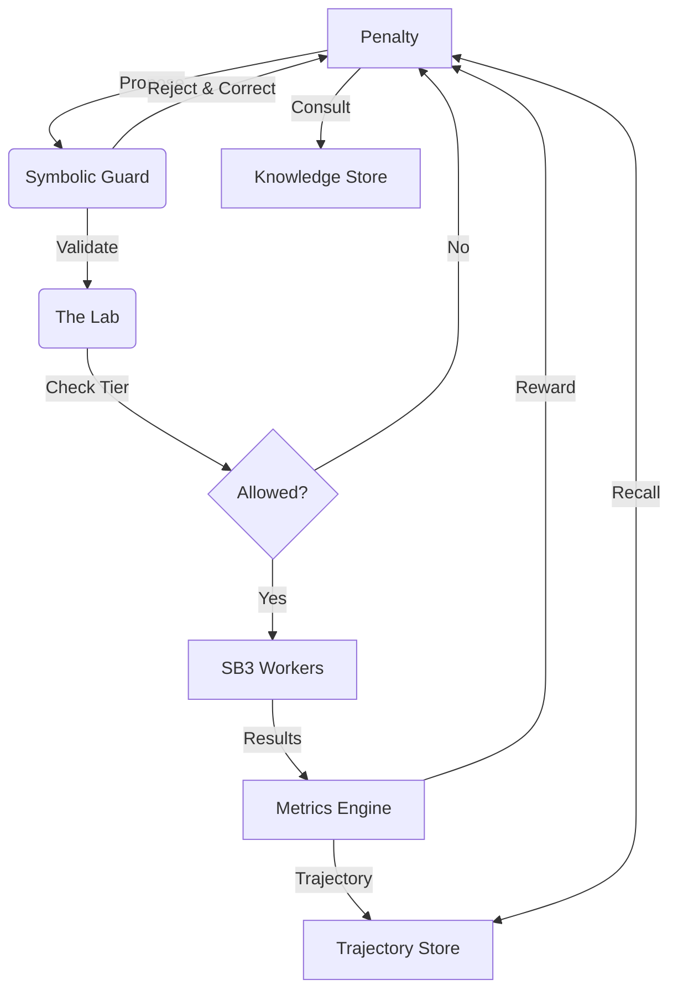

# 🧪 Meta-RL Scientist

**An Autonomous Multi-Agent RL Research Laboratory**

Meta-RL Scientist is a sophisticated, closed-loop simulation where AI agents act as **Reinforcement Learning Researchers**. These agents autonomously read literature, maintain causal models, and learn to execute parallel experiments through a recurrent neural network "Brain."

---

## 🚀 Key Features

### 🧠 Neural "Brain" Architecture
- **Sequence-Aware Model**: Researcher Agents use an **LSTM-based RNN** to process the sequence of past experiments.
- **Meta-PPO Training**: The "Scientist Brain" is optimized using Meta-Reinforcement Learning (PPO) to maximize discovery efficiency.
- **Multimodal State**: Inputs include performance trends, novelty landscapes, knowledge embeddings, and temporal metrics.

### 🎓 Self-Paced Curriculum
- **Tiered Progression**: Agents start on simple tasks and unlock harder ones only after proving proficiency.
    - **Tier 0**: `CartPole-v1`, `Pendulum-v1`
    - **Tier 1**: `LunarLander-v3`, `Acrobot-v1`
    - **Tier 2**: `MountainCarContinuous-v0`
- **Auto-Promotion**: The entire lab advances when *any* agent solves the current tier, fostering swarm collaboration.

### 🐝 Swarm Dynamics
- **Leaderboard**: Real-time ranking of agents by meta-reward and efficiency.
- **Resource Allocation**: Top performers receive **Bonus Experiment Slots**, accelerating their research.

### 💾 Long-Term Episodic Memory
- **Experiment Persistence**: Agents store and retrieve successful experiment configurations to initialize new search processes.
- **Context Injection**: The best past hyperparameters are injected directly into the Brain as a conditioning vector.

### 🏛️ Hierarchical Strategic Planning
- **Manager-Worker Core**: The Brain first determines a **Strategic Intent** (EXPLORE, EXPLOIT, or REFINE) before proposing tactical configurations.
- **Goal-Conditioned Policies**: Lower-level worker heads are soft-conditioned on the selected strategic goal.

### 🎭 Multi-Objective "Specialists"
- **Scientist Profiles**: Agents are spawned with distinct research mandates:
    - **Perf-Max**: Focused on absolute reward.
    - **Fast-Efficient**: Prioritizes speed and sample efficiency.
    - **Stable-Reliable**: Prioritizes consistency and low variance.
- **Multi-Objective Rewards**: Laboratory evaluation incorporates Performance, Stability, Efficiency, and Novelty into a single weighted meta-reward.
41: 
42: ### 🛡️ D3 Engine Integration (Neuro-Symbolic)
43: - **Trajectory Vector Compression**: Summarizes and embeds past experiments into a fixed vector space, providing the swarm with "Negative Knowledge" to avoid past failures.
44: - **Symbolic Verification Layer**: A deterministic guard that validates hyperparameters and estimates resource budgets before execution, ensuring safety and efficiency.

### 🛡️ D3 Engine Integration (Neuro-Symbolic)
- **Trajectory Vector Compression**: Summarizes and embeds past experiments into a fixed vector space, providing the swarm with "Negative Knowledge" to avoid past failures.
- **Symbolic Verification Layer**: A deterministic guard that validates hyperparameters and estimates resource budgets before execution, ensuring safety and efficiency.
- **Latent vs. Active Memory**: Long-term history is relegated to the vector store (Latent), while the agent's immediate context remains focused on the current frontier (Active).

---

## 🛠️ Architecture



---

## ⚡ Quick Start

### Installation
```bash
pip install -e .
pip install watchdog
```

### Running the Neural Scientist
```bash
# Start a 4-agent simulation with different "Scientist Profiles"
python marl_scientist/main.py --agent-type neural --num-agents 4 --steps 20
```

### Adding New Knowledge
Drop `.txt` or `.md` files into `knowledge/`. The **Async Watcher** will instantly ingest and embed them without stopping the simulation.

---

## 🗺️ Roadmap
- [x] Multi-Process Parallelization
- [x] Neural "Brain" (Meta-RL)
- [x] Async Knowledge Ingestion
- [x] Swarm Dynamics (Leaderboard, Bonus Slots)
- [x] Curriculum Learning (Tiers, Auto-Promotion)
- [x] Long-Term Episodic Memory
- [x] Hierarchical Decision-Making
- [x] Multi-Task Learning Scenarios
- [x] Multi-Agent Competitive Meta-Training (Self-Play)
- [x] Trajectory Vector Compression (D3 Engine Phase 1)
- [x] Symbolic Verification Layer (D3 Engine Phase 2)
- [ ] Active/Latent Agent Brain Split (D3 Engine Phase 3)
- [ ] Dynamic Neural Architecture Synthesis
