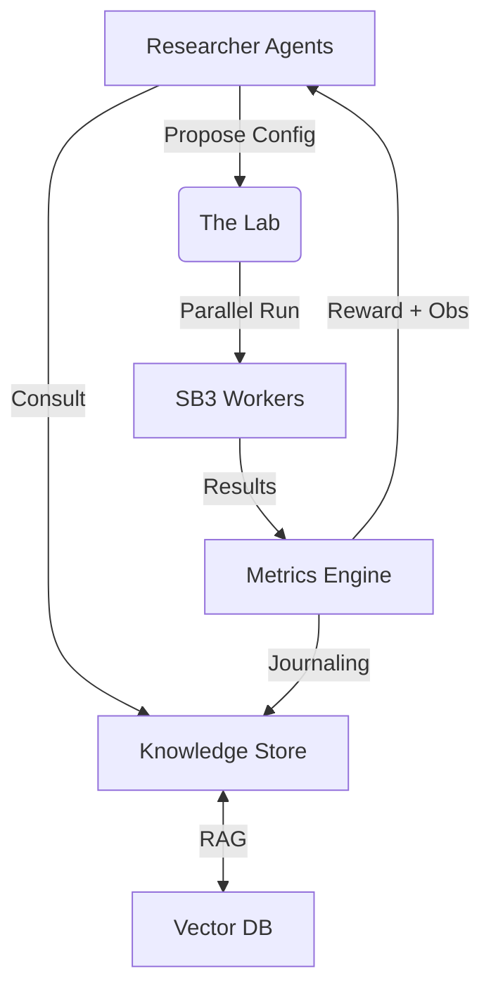

# 🧪 Meta-RL Scientist

**An Autonomous Multi-Agent RL Research Laboratory**

Meta-RL Scientist is a sophisticated, closed-loop simulation where AI agents act as **Reinforcement Learning Researchers**. These agents autonomously read literature, maintain causal models of hyperparameter dynamics, and execute parallel experiments to discover optimal RL configurations.

---

## 🚀 Key Features

### 🧠 Autonomous Researcher Agents
- **Literature Review (RAG)**: Agents query a local vector database of 100+ research papers to inform their experiment proposals.
- **Scientific Diversity**: Stochastic intent and probabilistic sampling ensure that agents explore diverse research directions.
- **Causal Reasoning**: An internal SEM (Structural Equation Model) engine allows agents to learn *why* specific parameters (like entropy coefficients or clipping ranges) impact performance.
- **Journaling**: High-performing discoveries are "published" back to the shared knowledge journal, enabling social learning.

### 🔬 The Laboratory Environment
- **Multi-Benchmark Suite**:
    - **Discrete**: `CartPole-v1`, `Acrobot-v1`, `LunarLander-v3`.
    - **Continuous**: `Pendulum-v1` (with full SAC support).
- **Parallel Execution**: Multi-processing runner achieves significant speedups by executing experiments in isolated subprocesses.
- **Resource Hardening**: Built-in environment cleanup and compatible-algorithm guarding prevent systemic failures and memory leaks.

### 📈 Adaptive Meta-Reward
- **Multi-Objective Optimization**: Agents are rewarded for high final return, novelty of approach, and training stability.
- **Stability Penalty**: Discourages brittle, high-variance hyperparameter configurations.

---

## 🛠️ Architecture



---

## ⚡ Quick Start

### Installation
```bash
# Clone the repository
git clone https://github.com/your-username/meta-rl-scientist.git

# Install dependencies (requires Gymnasium, SB3, Scikit-learn)
pip install -e .
```

### Running the Simulation
```bash
# Start a multi-agent simulation for 10 meta-steps
python marl_scientist/main.py --steps 10 --num-agents 4
```

### Monitoring
- **Logs**: Detailed tracebacks and experiment statuses are written to `simulation.log`.
- **Knowledge**: Scientific papers and discovered configurations are persisted in `kb_embeddings.pkl`.

---

## 🛠️ Requirements
- **Gymnasium** + `stable-baselines3`
- **LM Studio** / **Local LLM**: (Defaulting to `glm-4v-flash` and `nomic-embed`)
- **Python 3.10+**

---

## 🗺️ Roadmap
- [x] Multi-Process Parallelization
- [x] RAG-Informed Research Strategy
- [x] Continuous Action Space Support
- [x] Causal Discovery Integration
- [ ] Multi-Agent Competitive Meta-Training
- [ ] Vision-based Atari Benchmarks
- [ ] Dynamic Loss Function Synthesis
