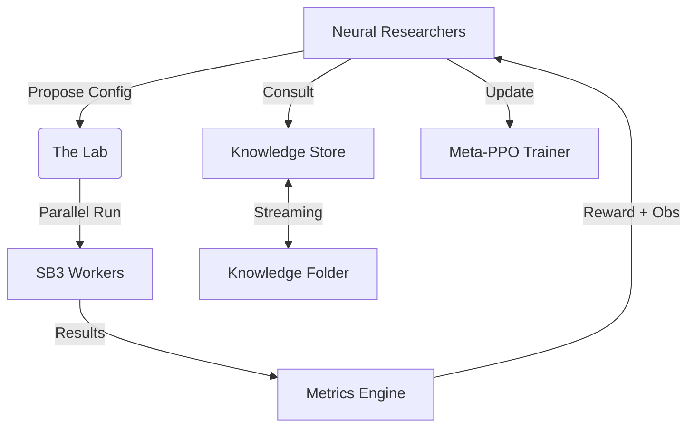

# 🧪 Meta-RL Scientist

**An Autonomous Multi-Agent RL Research Laboratory**

Meta-RL Scientist is a sophisticated, closed-loop simulation where AI agents act as **Reinforcement Learning Researchers**. These agents autonomously read literature, maintain causal models of hyperparameter dynamics, and learn to execute parallel experiments through a recurrent neural network "Brain."

---

## 🚀 Key Features

### 🧠 Neural "Brain" Architecture (New!)
- **Sequence-Aware Model**: Researcher Agents use an **LSTM-based RNN** to process the sequence of past experiments (Successes/Failures).
- **Meta-PPO Training**: The agents' "Scientist Brain" is optimized using Meta-Reinforcement Learning (PPO) based on their success in the meta-environment.
- **Multimodal State**: Brain inputs combine performance trends, novelty landscapes, and high-dimensional knowledge embeddings.

### 📚 Streaming Knowledge Pipeline
- **Incremental Ingestion**: A dedicated `knowledge/` folder acts as an inbox for new research summaries or expert opinions.
- **Auto-Archiving**: New files are automatically embedded via a local LLM and archived to `knowledge/processed/` during runtime, enabling live "learning" while the simulation is running.
- **LLM-RAG Integration**: Agents query the vector base to inform their neuro-symbolic experiment proposals.

### 🔬 The Laboratory Environment
- **Multi-Benchmark Suite**:
    - **Discrete**: `CartPole-v1`, `Acrobot-v1`, `LunarLander-v3`.
    - **Continuous**: `Pendulum-v1` (with full SAC support).
- **Parallel Execution**: Multi-processing runner executes experiments in isolated subprocesses for maximum throughput.

---

## 🛠️ Architecture



---

## ⚡ Quick Start

### Installation
```bash
# Install dependencies
pip install -e .
```

### Running the Neural Scientist
```bash
# Start a neural-agent simulation for 10 meta-steps
python marl_scientist/main.py --agent-type neural --num-agents 2 --steps 10
```

### Adding New Knowledge
Simply drop `.txt` or `.md` files into the `knowledge/` directory. The simulation will pick them up, embed them, and move them to `knowledge/processed/` automatically.

---

## 🛠️ Requirements
- **Gymnasium** + `stable-baselines3`
- **PyTorch** (for the Neural Brain)
- **LM Studio** / **Local LLM**: (Defaulting to `glm-4v-flash` and `nomic-embed`)

---

## 🗺️ Roadmap
- [x] Multi-Process Parallelization
- [x] RNN-based Neural "Brain" (Meta-RL)
- [x] Streaming Knowledge Ingestion (Archiving)
- [x] Continuous Action Space Support
- [ ] Multi-Agent Competitive Meta-Training (Self-Play Research)
- [ ] Vision-based Atari Benchmarks
- [ ] Dynamic Neural Architecture Synthesis
